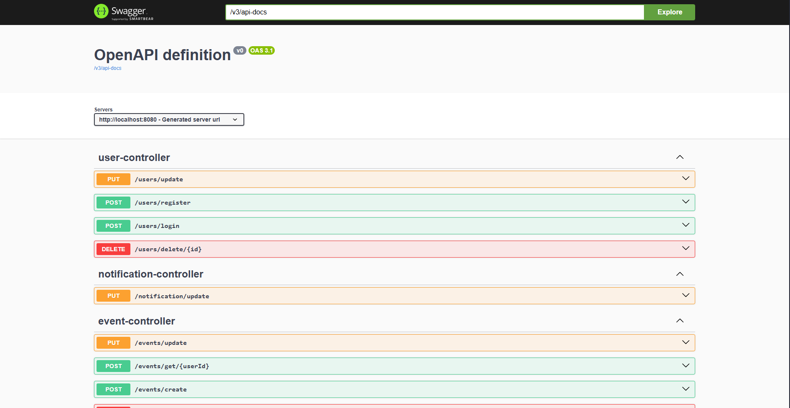

## Calendar Project
O Calendar Project é uma aplicação de calendário que permite salvar seus eventos e tarefas de forma prática e organizada. Com ele, você pode registrar seus compromissos com poucas informações e contar com o sistema de notificações automáticas para nunca mais esquecer um evento importante.

Gerencie sua rotina com facilidade: agende, acompanhe e seja lembrado no momento certo — tudo isso sem complicações.
## Documentação da API

### Usuários

#### Registra um novo usuário no sistema

```http
  POST /users/register
```

| Parâmetro   | Tipo       | Descrição                           |
| :---------- | :--------- | :---------------------------------- |
| `username` | `string` | **Obrigatório**. Nome do usuário |
| `email` | `string` | **Obrigatório**. E-mail do usuário |
| `password` | `string` | **Obrigatório**. Senha do usuário |
| `birth_date` | `local date` | **Obrigatório**. Data de nascimento do usuário |

#### Realiza o login do usuário e retorna suas informações

```http
  POST /users/login
```

| Parâmetro   | Tipo       | Descrição                                   |
| :---------- | :--------- | :------------------------------------------ |
| `email`      | `string` | **Obrigatório**. O e-mail do usuário para acessar a plataforma |
| `password`    | `string` | **Obrigatório**. A senha do usuário para acessar a plataforma |

#### Atualiza os dados do usuário

```http
  PUT /users/update
```

| Parâmetro   | Tipo       | Descrição                           |
| :---------- | :--------- | :---------------------------------- |
| `id` | `int` | **Obrigatório**. Id do usuário |
| `username` | `string` | **Obrigatório**. Nome do usuário (alterado se quiser) |
| `email` | `string` | **Obrigatório**. E-mail do usuário (alterado se quiser)|
| `password` | `string` | **Obrigatório**. Senha do usuário (alterado se quiser)|
| `birth_date` | `local date` | **Obrigatório**. Data de nascimento do usuário (alterado se quiser)|

#### Deleta o usuário do sistema

```http
  DELETE /users/delete/{id}
```

| Parâmetro   | Tipo       | Descrição                                   |
| :---------- | :--------- | :------------------------------------------ |
| `id`      | `int` | **Obrigatório**. O id do usuário enviado como variável do path |

### Eventos

#### Registra um novo evento no sistema

```http
  POST /events/register
```

| Parâmetro   | Tipo       | Descrição                           |
| :---------- | :--------- | :---------------------------------- |
| `user_id` | `int` | **Obrigatório**. Id do usuário |
| `eventType` | `EventType` | **Obrigatório**. Tipo do Evento [task ou compromise] |
| `title` | `string` | **Obrigatório**. Título do evento|
| `description` | `string` | **Obrigatório**. Descrição do evento|
| `date` | `date` | **Obrigatório**. Data do evento|

#### Retorna os eventos do usuário, se houver

```http
  POST /events/get/{userId}
```

| Parâmetro   | Tipo       | Descrição                                   |
| :---------- | :--------- | :------------------------------------------ |
| `id`      | `int` | **Obrigatório**. O id do usuário enviado como variável do path |

#### Atualiza o evento

```http
  PUT /events/update
```

| Parâmetro   | Tipo       | Descrição                           |
| :---------- | :--------- | :---------------------------------- |
| `id` | `int` | **Obrigatório**. Id do evento |
| `user_id` | `int` | **Obrigatório**. Id do usuário |
| `eventType` | `EventType` | **Obrigatório**. Tipo do Evento [task ou compromise] |
| `title` | `string` | **Obrigatório**. Título do evento|
| `description` | `string` | **Obrigatório**. Descrição do evento|
| `isCompleted` | `boolean` | **Obrigatório**. Se o evento já está completo ou não|
| `date` | `date` | **Obrigatório**. Data do evento|

#### Deleta o Evento

```http
  DELETE /events/delete/{eventId}
```

| Parâmetro   | Tipo       | Descrição                                   |
| :---------- | :--------- | :------------------------------------------ |
| `id`      | `int` | **Obrigatório**. O id do evento enviado como variável do path |

### Notificações

#### Atualiza as notificações existentes (todas são criadas juntamente ao usuário e aos eventos)

```http
  PUT /notification/update
```

| Parâmetro   | Tipo       | Descrição                           |
| :---------- | :--------- | :---------------------------------- |
| `id` | `long` | **Obrigatório**. Id da notificação |
| `title` | `string` | **Obrigatório**. Título da notificação|
| `description` | `string` | **Obrigatório**. Descrição da notificação|
| `hasSeen` | `boolean` | **Obrigatório**. Se a notificação já foi vista ou não|


## Autenticação

Após o login com sucesso (POST /users/login), você receberá um token JWT por meio do header da resposta. Esse token deve ser enviado no cabeçalho das requisições autenticadas como:

```text
Authorization: Bearer <seu_token_jwt>
```

Rotas que exigem autenticação:

- /events/*
- /notification/*
- /users/update
- /users/delete/{id}

## Swagger

A API está totalmente documentada com Swagger. Acesse o [endpoint de documentação](http://localhost:8080/swagger-ui/index.html#/) para visualizar todas as rotas, parâmetros e testar diretamente pela interface interativa.


## Stack e Ferramentas utilizadas

- Java 23
- Spring Boot 3
- JUnit 5
- Mockito
- Docker

## Banco de dados
Confira a modelagem do banco de dados [aqui](https://dbdiagram.io/d/Calendar-DB-67bf8854263d6cf9a096a7c3)